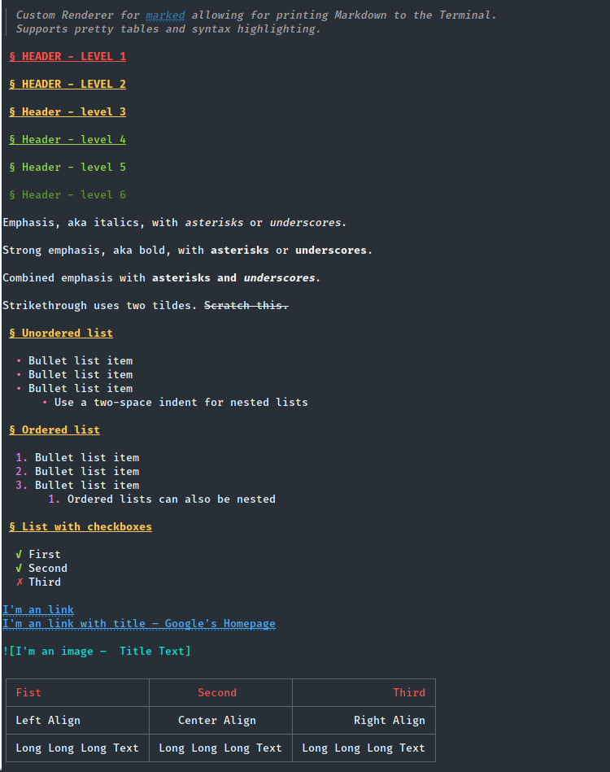

cli-marked
===

> Custom Renderer for [marked](https://github.com/chjj/marked) allowing for printing Markdown to the Terminal.
Supports pretty tables and syntax highlighting

Could for instance be used to print usage information.

[](https://travis-ci.org/mikaelbr/marked-terminal) [](https://www.npmjs.com/package/marked-terminal)

## Install

```sh
npm i -g cli-marked
```

## Example

```sh
md README.md
```

This will produce the following:



### Tables


### Lists


